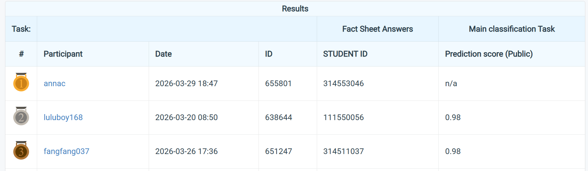

# NYCU Computer Vision 2026 HW1

* **Student ID:** 314511037
* **Name:** 張周芳

## Introduction
This project implements an image classification pipeline for HW1 using a student–teacher knowledge distillation framework.  
The student model is trained using both hard labels and soft predictions from the teacher model to improve generalization performance.

The project includes:
- A notebook for training the teacher model
- A notebook for training the student model with knowledge distillation
- Evaluation on the validation dataset 
- A notebook for inference to generate predictions on the test dataset

## Dataset
Place the dataset folder under the following structure:
```
CV_HW1/
├─ data/
│    ├─ train/
│    ├─ val/
│    └─ test/
├─ teacher_model.pth # Pretrained teacher model (optional)
├─ student_model.pth # Final trained model (output)
├─ requirements.txt
├─ cvhw1-teacher-training-process.ipynb
├─ cvhw1-student-training-process.ipynb
└─ cvhw1-inference-process.ipynb
```
> Note: When using Colab, upload the dataset and model files to your environment, and update the paths in the notebooks accordingly.

## Environment Setup

- Python 3.10+
- GPU recommended (CUDA supported)

This project was developed and tested on Google Colab and Kaggle, where most required packages are pre-installed.  
For running this project on your local machine, follow the steps below.

### Step 0: Clone the Repository

```bash
git clone https://github.com/fangfangirl/CV_HW1.git
cd CV_HW1
```
### Step1: Using Conda (Recommended do)

```bash
# Create a conda environment
conda create -n cv-hw1 python=3.10 -y

# Activate environment
conda activate cv-hw1
```
### Step2: Install PyTorch

Please install PyTorch based on your system configuration:

1. Visit: [https://pytorch.org/get-started/locally/](https://pytorch.org/get-started/locally/)
2. Select your OS, package (pip), and CUDA version
3. Run the generated command

Example (CUDA 12.6):
```bash
pip3 install torch torchvision --index-url https://download.pytorch.org/whl/cu126
```
### Step3: Install Other Dependencies
```bash
pip install -r requirements.txt
```

## Usage

### Training

1. Teacher Model Training: Open and run `cvhw1-teacher-training-process.ipynb` to train the teacher model and save the weights (e.g., teacher_model.pth).
2. Student Model Training (Knowledge Distillation): Open and run `cvhw1-student-training-process.ipynb`. This notebook loads the teacher's weights and trains the student model using a distillation loss (a combination of CrossEntropy and KL Divergence).
The notebook also evaluates the student model on the validation dataset after each epoch and after the final epoch.

### Inference
* The inference logic is included at the end of the student training notebooks.
* Alternatively, you can run cvhw1-inference-process.ipynb to generate predictions on the test dataset using pretrained student weights.
* Ensure the model weights are placed in the directory specified in the notebook.
> Note: Only the student model is required for inference.

## Performance Snapshot

| Model       | Dataset     | Accuracy | 
|------------ |------------ |---------|
| Teacher     | Train       | 96.39%  |
| Teacher     | Validation  | 93.67%  |      
| Student     | Train       | 84.49%  | 
| Student     | Validation  | 94.33%  | 
| Student     | Test        | 98.00%  | 

下面是leaderboard 截圖

